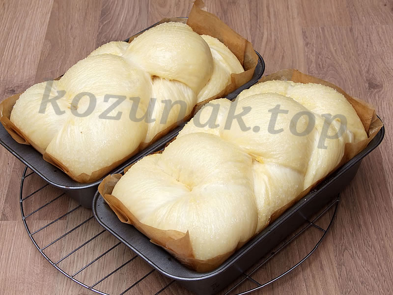
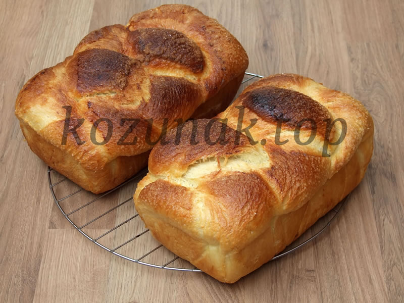
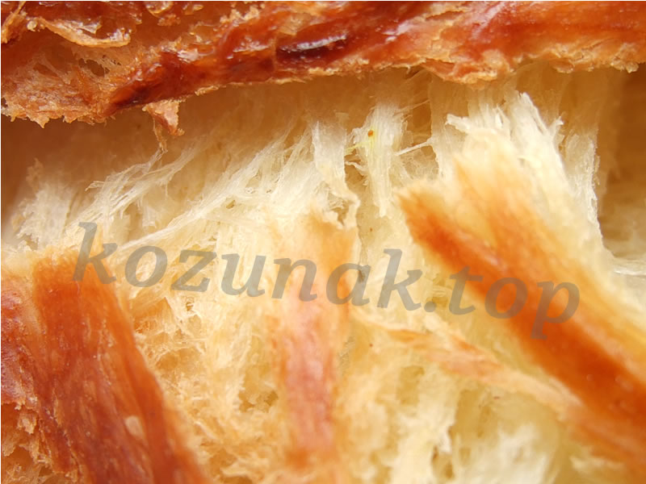
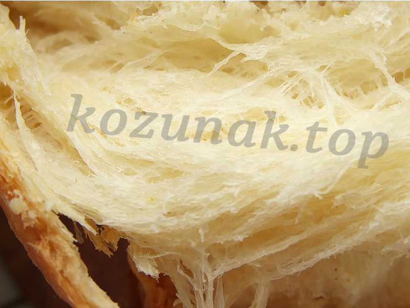
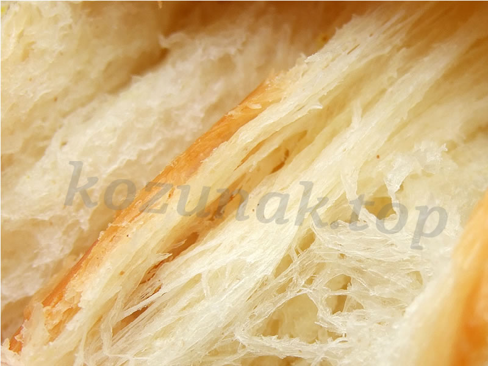

# [kozunak.top](https://kozunak.top)

## Козунак на конци - лесна изпитана рецепта за домашно приготвяне

Този сайт представя подробна, изпитана рецепта за приготвяне на традиционен български козунак на конци у дома. Рецептата е разработена след 5 години експерименти и над 150 изпечени козунака, с фокус върху използването на хлебопекарна машина за улеснение на процеса.

### Основни характеристики
- **Лесна технология**: Подходяща за начинаещи, без нужда от активиране на маята или прекалено месене.
- **Използване на хлебопекарна**: Програма "тесто за макарони" за първоначално замесване.
- **Втасване на стайна температура**: Практично разпределение на времето, включително през нощта.
- **Брашно за баници**: Ключов елемент за постигане на разкошни конци.

### Снимки от рецептата

*Разкошно втасалите козуначета преди печене.*

*Изпечения козунак с карамелизирана захарна коричка.*

*Добре оформените конци на козунака.*

*Макро снимка на разкошно оформените козуначени конци.*

*Още една макро снимка на конците.*

### Подробни рецепти (PDF файлове)
В папката `pdfs/` ще намерите детайлни версии на рецептата:

- [Козунак на конци - подробна рецепта за начинаещи 2019_v1](pdfs/kozunak-na-konci-recepta-2019-v1.pdf)
- [Козунак на конци - подробна рецепта за начинаещи 2017_v3](pdfs/recepta_kozunak_2017_v3.pdf)
- [Брашно - тесто - конци. Пътят към перфектния козунак](pdfs/brashno-testo-konci-perfekten-kozunak.pdf)
- [Козунак на конци изцяло в хлебопекарна - доза за една машина - подробна рецепта](pdfs/kozunak-izcialo-v-hlebopekarna-podrobna.pdf)
- [Козунак изцяло в хлебопекарна - съкратена версия](pdfs/kozunak-izcialo-v-hlebopekarna-kratka.pdf)
- [Домашен пухкав кознунак на "конци" от Маргарита Добрева](pdfs/kozunak-margarita-dobreva.pdf)
- [Лесен козунак - доза една хлебопекарна](pdfs/marzeliv-kozunak-na-konci-izcialo-v-hlebopekarna.pdf)
- [Рецепта за хлебопекарната Мулинекс](pdfs/Kozunak-Moulinex.pdf)

### Автор и контакти
- **Автор**: Denislav Dimitrov (denyo75@abv.bg)
- **Facebook страница**: [kozunaknakonci](https://www.facebook.com/kozunaknakonci/)
- **Facebook група**: [kozunak](https://www.facebook.com/groups/kozunak/)
- **Facebook пост**: [Рецепта за козунак](https://www.facebook.com/denislav.dimitrov.14/posts/1520064724678544)

### Митове за козунака
В сайта са разгледани често срещани митове като необходимостта от много месене, топла стая, активиране на маята и др. Препоръчваме да ги прочетете за по-добро разбиране.

### Забележки
- Всички права запазени. Копирането на съдържание е забранено без разрешение.
- Ако имате въпроси или коментари, свържете се чрез Facebook.

Светъл празник и приятен апетит! 🍞 ♥️
